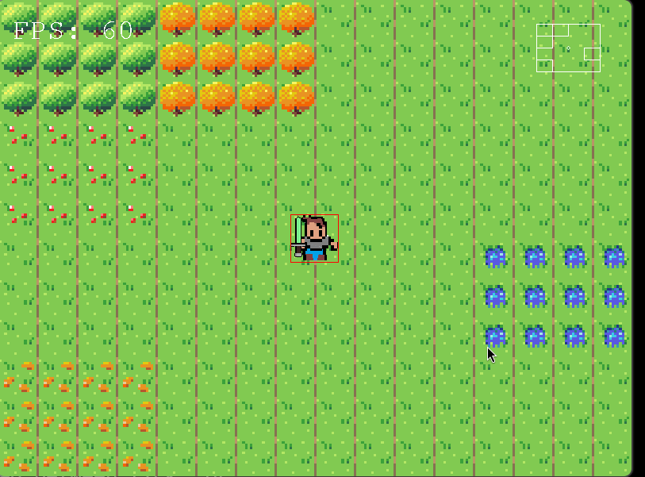

# Description
(Unfinished) 2D Side-scrolling game in SDL2. Similar in style to old Nintendo games. Works on Native Linux x86_64 and WASM32. Other platforms not supported (yet)



# Dependencies
SDL2, Emscripten, Bozohttpd or equivalent.

See: https://wiki.libsdl.org/SDL2/README/emscripten

See: http://www.eterna23.net/bozohttpd/

# Native Linux X86_64
## Build
```sh
# In the project directory.
make
```
## Run
### Game
```sh
./build/game
```
### MapEditor
```sh
./build/mapeditor
```

# WASM32
## Build
```sh
git clone https://github.com/emscripten-core/emsdk.git
cd emsdk
git pull
./emsdk install latest
./emsdk activate latest
source ./emsdk_env.sh
make

tar -xf bozohttpd-20240126.tar.bz2
cd bozohttpd-20240126
make -f Makefile.boot
```

## Run
You can probably serve it from somewhere else but `bozohttpd` seems lightweight and works.
See: http://www.eterna23.net/bozohttpd/
```
./serve.sh
```
Then head to localhost:8000 to see the game.